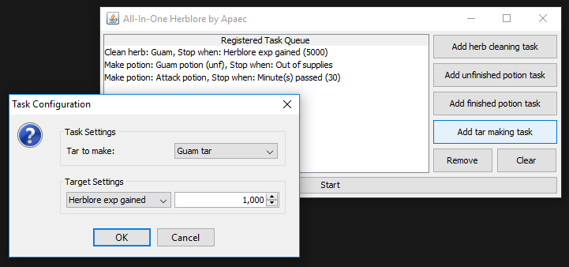
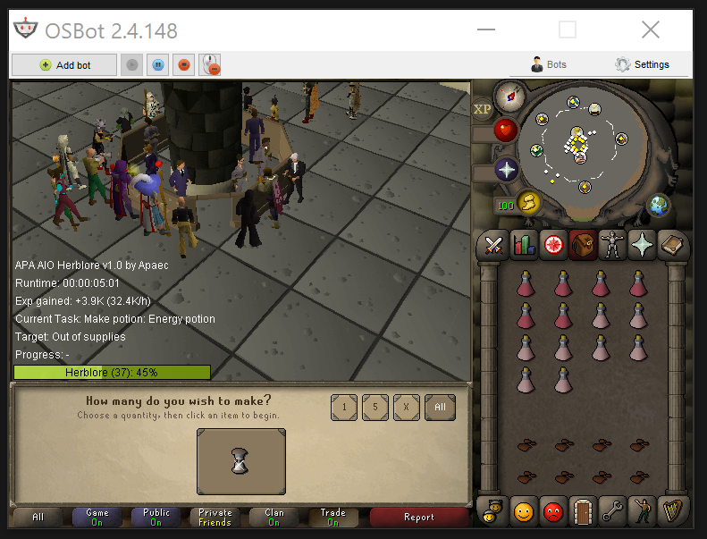

# APA All-In-One Herblore
A task based all-in-one herblore script for Oldschool Runescape.
Written by Apaec for OSBot http://osbot.org/

*This project has been released on the OSBot SDN: https://osbot.org/mvc/sdn2/scripts/10*

## Gallery

### Startup interface

### Script in action

## License
[MIT license](./LICENSE)
